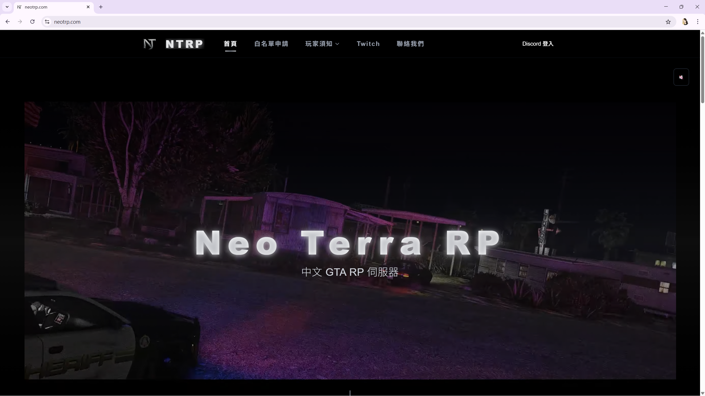
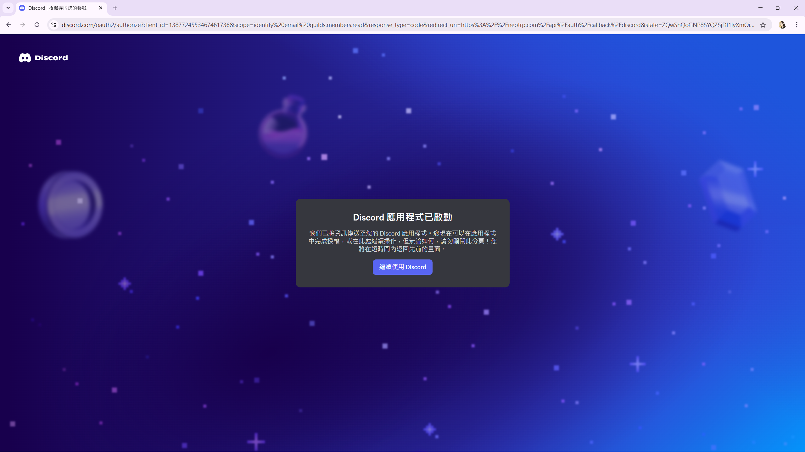
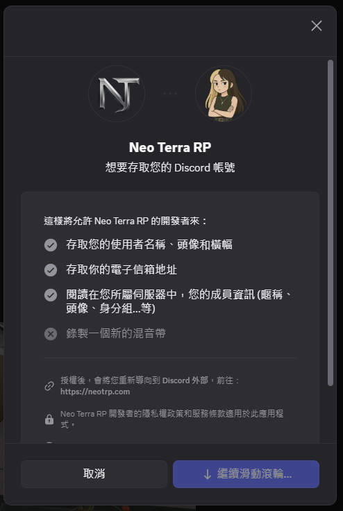
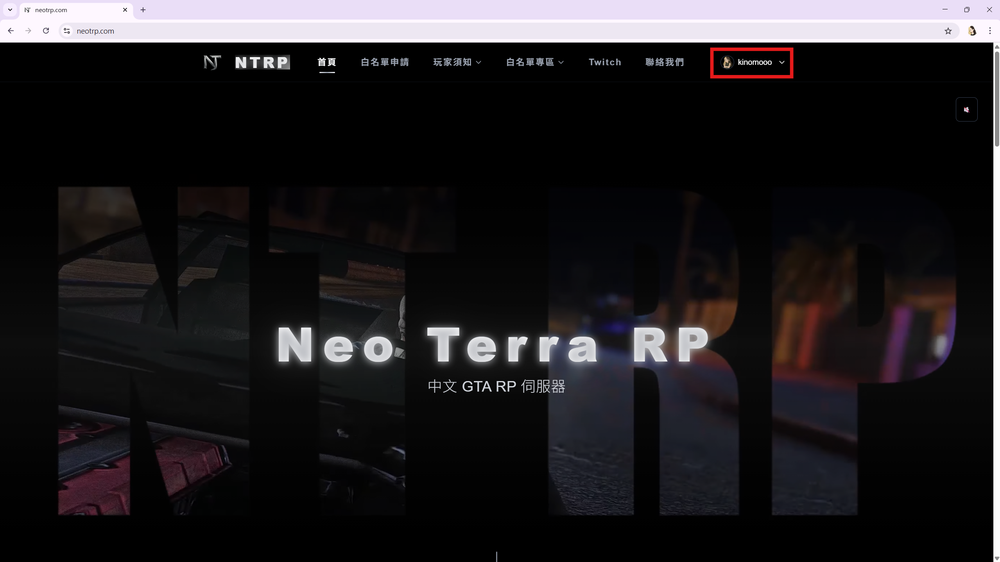
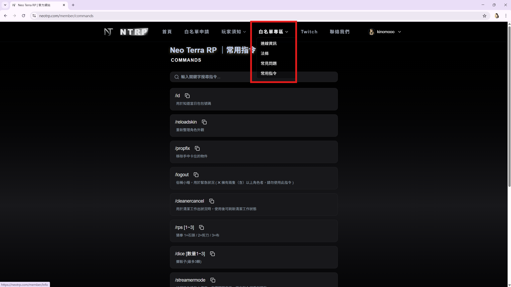
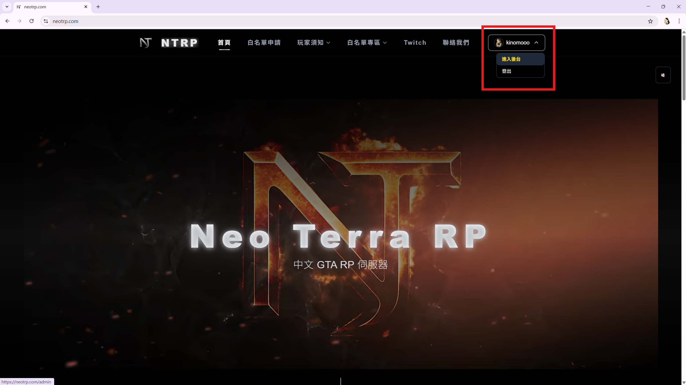
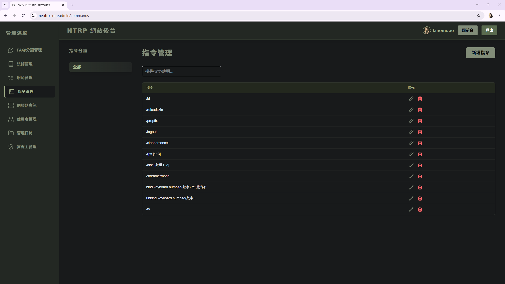
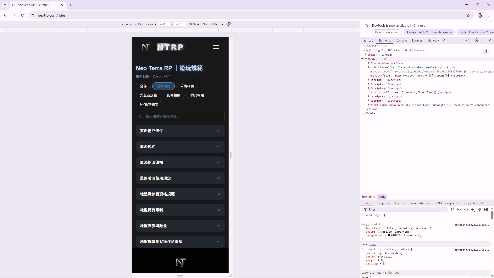

# NTRP網站 — Showcase

> 這是 **NTRP網站** 專案的公開展示倉庫，提供「架構說明、功能截圖、代表性程式碼片段」。  
> **完整原始碼為私有**。  
> 🌐 **DEMO：平常關閉；求職期間會開放**（開放時會在此更新連結）。

## ✨ 專案概要
- **服務對象**：Neo Terra RP 伺服器的玩家  
- **功能定位**：整合遊戲過程所需的規範、FAQ、常用指令等資訊，提供分類、搜尋與更佳的瀏覽體驗；部分內容僅限具備白名單身分的玩家登入後可見，用以保護玩法不被外部抄襲  
- **內容維護**：具管理員權限的使用者可透過後台修改內容，前端即時更新  
- **專案狀態**：2025 年 7 月正式上線，目前仍在營運中；維護內容包含 Bug 修復與依管理員需求新增功能，RP伺服器結束後將改為公開展示

## 🧰 技術棧
- **Frontend/SSR**：Next.js (App Router), TypeScript, TailwindCSS
- **Backend**：Next.js Route Handlers（REST）
- **Auth**：Discord OAuth（示意流程）
- **DB/ORM**：PostgreSQL + Prisma
- **Infra**：Ubuntu (Vultr VPS), Nginx, PM2, Cloudflare SSL
- **CI/CD**：GitHub Actions（建置/基本檢查）

## 🖼️ 截圖

### 首頁

---

### 登入 / 授權流程
| 授權頁面 | 確認畫面 | 登入後 |
|---|---|---|
|  |  |  |

---

### 白名單專區

---

### 管理員後台
| 玩家清單 | 內容管理 |
|---|---|
|  |  |

---

### 手機版

## 🧩 代表性程式碼
- Middleware（安全與標頭策略）：[`snippets/middleware.ts`](./snippets/middleware.ts)
- OAuth 入口（簡化範例）：[`snippets/api-auth-route.ts`](./snippets/api-auth-route.ts)
- Prisma Schema 片段（抽象化）：[`snippets/prisma-schema.excerpt.prisma`](./snippets/prisma-schema.excerpt.prisma)
- UI 元件示例：[`snippets/component-Card.tsx`](./snippets/component-Card.tsx)

## 🏗️ 架構說明
請見 [`ARCHITECTURE.md`](./ARCHITECTURE.md)。

## 🔒 原始碼政策
- 本倉庫僅作展示用途。
- 本倉庫不包含任何憑證、金鑰或可重建完整服務的關鍵程式。

## 📫 聯絡
- LinkedIn：**[https://linkedin.com/in/kinommoo]**
